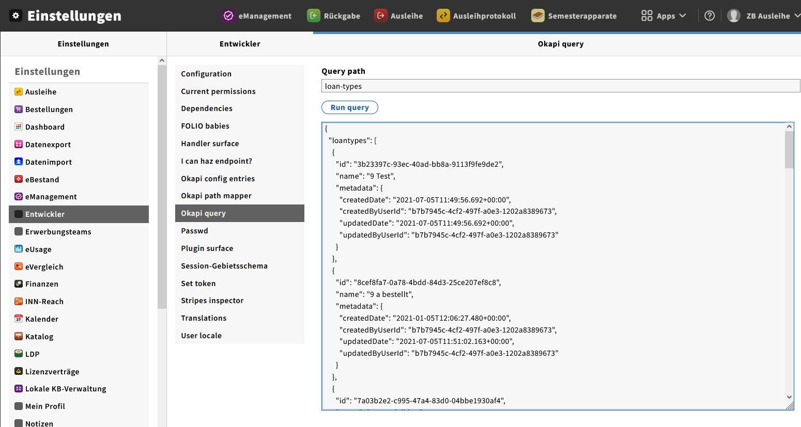

# cbs2folio-transformations for Hebis

This is the place where all cbs2folio transformations for Hebis are collected. The instance
mappings "pica2instance-new.xsl" and "relationships.xsl" are generally re-used from GBV.

## This is the current harvester pipeline:

1. `hebis/pica2instance-new.xsl` (compatible and improved copy of `pica2instance-new.xsl`) 
1. `hebis/relationships.xsl` (compatible and improved copy of `relationships.xsl`) 
1. `hebis/holding-items-hebis.xsl`
1. `hebis/holding-items-hebis-ilnxx.xsl`
1. `hebis/codes2uuid-hebis-ilnxx.xsl`
1. `hebis/codes2uuid-hebis.xsl`

## Essential hebis-wide UUID objects folder - need to be imported from folder referenceRecords:

- `K10plus/instance-statuses`
- `codes2uuid/holdings-sources`
- `codes2uuid/identifier-types`
- `codes2uuid/item-note-types`
- `codes2uuid/material-types`

## How to get local UUIDs for locations and loan-types

A convenient way to get UUIDs for locations and loan types directly from the FOLIO APIs via the built-in Okapi query client.   
You can access it by selecting 'Settings' -> 'Developers' -> 'Okapi Query'.  
Simply type 'locations' or 'loan types' into the query and run the query to get the results:  

To be completed...

